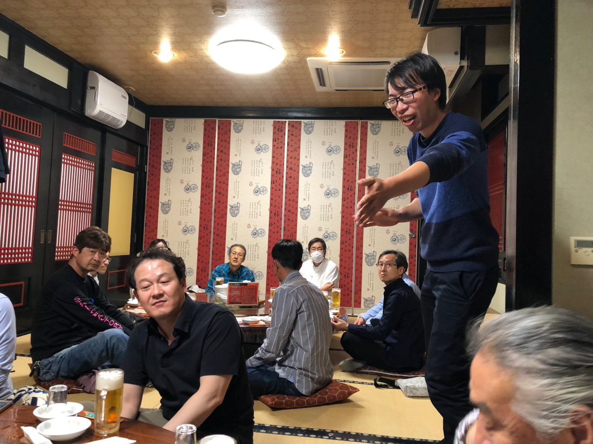
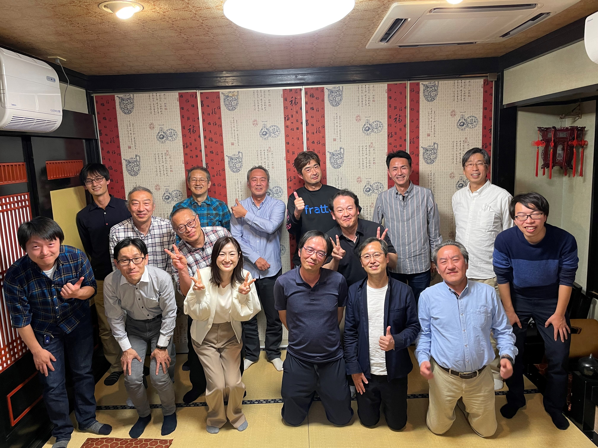

<html>
<head>

<meta charset="UTF-8">
<meta http-equiv="Content-Type" content="text/html; charset=UTF-8">
<meta http-equiv="X-UA-Compatible" content="IE=EmulateIE10" />
<meta http-equiv="X-UA-Compatible" content="IE=edge">

<!--ここから上はお決まりの定型文です-->

<title>法規技術情報課、解散会</title>

<!--ここからが表現の書式などを決めるcssという部分-->

<link href="https://cdnjs.cloudflare.com/ajax/libs/lightbox2/2.7.1/css/lightbox.css" rel="stylesheet">

</head>

<body>

  モバイル端末をお使いの場合は、画面を横向きにすると
  より見やすくご覧頂けます。

    
<!--ここまでは定型文としてそのままコピペして再利用します-->
    
<h1><marquee behavior="left">!!! 2023年3月31日、法規技術情報課解散会＠山泉楼 !!!</marquee></h1>
    <h2>99期、最終日での開催となりました。</h2>
                         

<h3>法規技術情報課の皆様  

お世話になっております。4MOC 開発企画部 法規技術情報課 豊田(尊)です。  

皆様ご存じの通り、来期より新体制へ移行します。 
つきましては、法規技術情報課の解散会を下記の通り開催致します。  

日時：2023年3月31日（金）19時30分より 
場所：JR宇都宮駅周辺 
会費：6,000円程度 
幹事：井上、豊田、並木 
場所等詳細は決定後再度連絡します。  

恐れ入りますが、3月1日（水）までに 
出欠を下記リンク先DBのエクセルに記入ください。 
➡出欠確認  

宜しくお願い致します。  

*********************************************** 
豊田 尊也（Takaya Toyota） 
本田技研工業(株) 四輪事業本部 
開発戦略統括部 開発企画部 法規技術情報課 
Mobile：080-4904-4085　（Ext.8747245) 
E-mail：takaya_toyota@jp.honda 
***********************************************  
</h3>
    
    
<h2>解散会のスタート！</h2>

<h2>以下動画 限定公開です → このHPから飛ばないと見られません。</h2>
<iframe width="560" height="315" src="https://www.youtube.com/embed/HYHixQl4kF8" title="YouTube video player" frameborder="0" allow="accelerometer; autoplay; clipboard-write; encrypted-media; gyroscope; picture-in-picture; web-share" allowfullscreen></iframe>
	
<iframe width="560" height="315" src="https://www.youtube.com/embed/rcqf3Pc3hEQ" title="YouTube video player" frameborder="0" allow="accelerometer; autoplay; clipboard-write; encrypted-media; gyroscope; picture-in-picture; web-share" allowfullscreen></iframe>
	
<iframe width="560" height="315" src="https://www.youtube.com/embed/rS8p7PBHefo" title="YouTube video player" frameborder="0" allow="accelerometer; autoplay; clipboard-write; encrypted-media; gyroscope; picture-in-picture; web-share" allowfullscreen></iframe>
	
<iframe width="560" height="315" src="https://www.youtube.com/embed/-WbOvMDtWV0" title="YouTube video player" frameborder="0" allow="accelerometer; autoplay; clipboard-write; encrypted-media; gyroscope; picture-in-picture; web-share" allowfullscreen></iframe>
	
                         
                          

<h2>今回も幹事の皆様のご尽力で２時間たっぷり楽しませて頂きました！ どうもありがとう御座いました。
	</h2>
<footer>
    
Copyright S.Hada 2023 @法規技術情報課(RTID)

</footer>
    
<!--HPにさまざまなJavaScriptを呼び込むための書式-->

</body>

</html>
